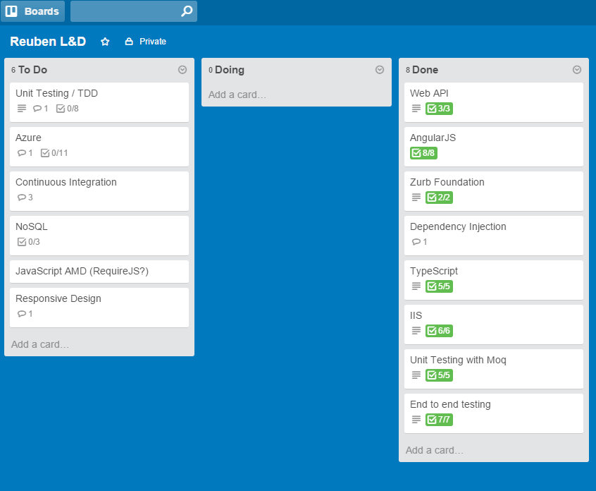
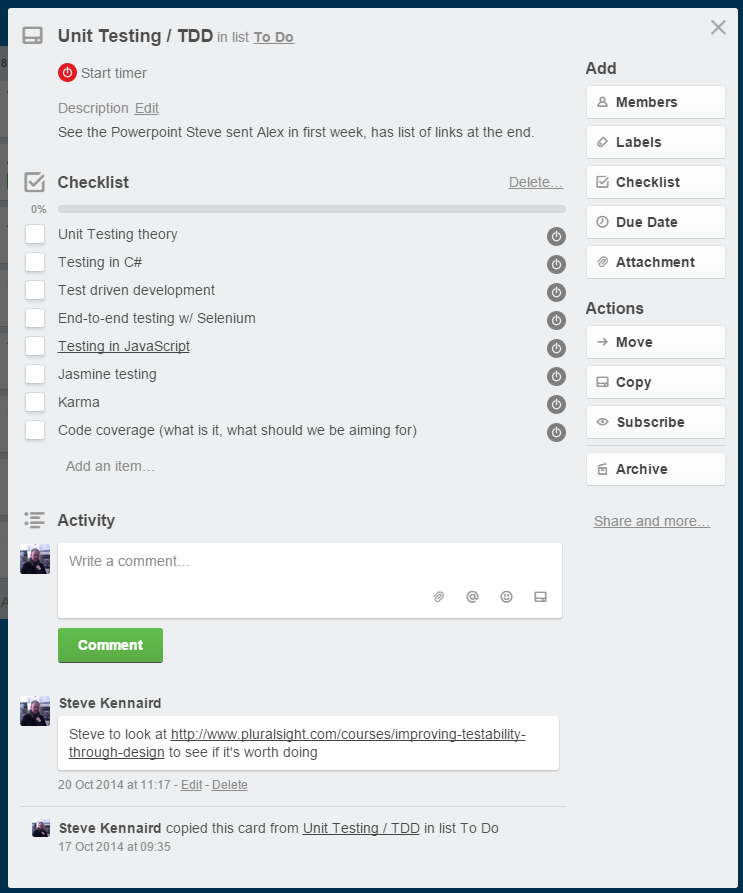

As a leader, ensuring your team learn and progress is a fundamental part of your role. You don't really want a bunch of developers building/maintaining your products who don't suggest improvements based on the latest tools and theories, do you?

Plus, if they're not given the chance to improve their skills, or see that there's no opportunity to apply new skills, there's more chance they'll become demotivated (and less productive), and some will end up leaving to find that opportunity elsewhere. And they'll take their knowledge of your company and projects with them.

Taking time out of the schedule to allow people to do their own development _should_ pay for itself in the long run. Ok, so looking just at the decreased amount of time available, the net amount of work produced by each person every month should decrease. But you could quite easily argue that this is outweighed by:

* Happier people being more productive as they're more engaged in the company and their role in its success
* Efficiencies adopted from new skills. Say if a frontend dev decided to learn about SASS and stopped coding in plain CSS...wouldn't take long to learn, and the time saved in creation of new stylesheets (less code needed versus plain CSS) and maintenance over time (better structured CSS output) would vastly outweigh the few hours spent learning.
* Lower recruitment costs. If people can grow in your company, they're more likely to stay (plus recruitment is expensive!)

So not only is it the "right" thing to do for your people, there's an obvious business case too. But just doing it isn't enough - let people drive their own learning, and provide some structure too. Ensure they can catch up with a more experienced member of the team once they've done the learning, so they have the opportunity to ask questions on anything they didn't understand.

Start by having an honest discussion with each person, ask them where their weaknesses are, and objectively suggest areas you think they could improve on. And it's wise to start with things that are relevant, once they're at an amazing level they can start looking at "pie in the sky" stuff that may not be useful to the business. That way they can build confidence that they can do their every day role to a high level before taking on something new that they might never get to use.

From there, we run monthly face-to-face catch-ups on L&D, and use [Trello](http://www.trello.com/) to manage progress and maintain a list of new things for people to learn. It's free (until you need "[Business Class](https://trello.com/business-class)" features!) and it's easy to use, and can be adapted to suit a range of scenarios. Plus the manager can see progress as it happens, and conversations around learning subjects can be done on the Trello board, not lost on email.

It's a no brainer - even if you're a small company, hopefully you can see that the benefits listed above far outweigh the cost if the whole thing is well managed.
